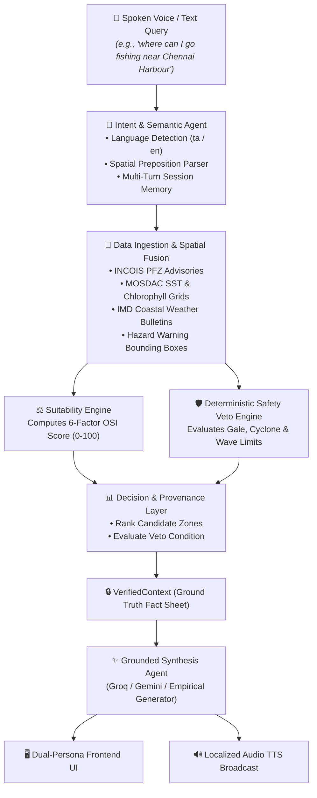

<div align="center">

# 🐋 ORCA: Marine Ecosystem Reasoning with Collaborative Agents
### Smart India Hackathon (SIH26176) — Ocean AI & Marine Advisory Decision Support System

[](https://fastapi.tiangolo.com)
[](https://reactjs.org)
[](https://www.typescriptlang.org)
[](https://www.python.org)
[](https://tailwindcss.com)
[](https://vitejs.dev)

<p align="center">
  <b>Transforming satellite oceanography and meteorological alerts into actionable, safety-first, voice-guided intelligence for artisanal fishermen and marine analysts across India's coastline.</b>
</p>

[Key Features](#-key-features) •
[Architecture](#-system-architecture) •
[Installation & Quick Start](#-installation--quick-start) •
[API Reference](#-api-reference) •
[Verification & Testing](#-testing--validation) •
[Repository Links](#-git-repository)

</div>

---

## 🌊 Overview & Problem Statement

India possesses a coastline exceeding 7,500 km, supporting over 4 million artisanal fishermen and active maritime fleets. However, marine data from official scientific sources—such as **INCOIS** (Potential Fishing Zones), **MOSDAC/ISRO** (Ocean Color & Sea Surface Temperature), and **IMD** (Marine Weather & Cyclone Warnings)—are published in fragmented bulletins, raw NetCDF grids, and complex technical charts.

### The Challenge
- **Data Fragmentation**: Ocean thermal fronts, chlorophyll concentration, wind vectors, and hazard bulletins reside in isolated portals.
- **Language & Literacy Barriers**: Artisanal fishermen require direct, voice-first guidance in their native language (e.g., Tamil, Telugu, Malayalam, Hindi).
- **Safety Criticality**: Commercial recommendations must **never** jeopardize lives. If a cyclone, squall, or severe gale warning is active, safety vetoes must trigger unconditionally.

### The ORCA Solution
**ORCA** is a multi-agent ocean intelligence platform. It ingests multi-source satellite and meteorological observations, resolves natural-language voice/text queries dynamically with **zero hardcoding**, evaluates a deterministic 6-factor **ORCA Suitability Index (OSI)**, applies an uncompromised **Safety Veto Engine**, and delivers localized spoken voice broadcasts alongside an interactive spatial GIS telemetry dashboard.

---

## ⚡ Key Features

### 1. 🤖 Multi-Agent Collaborative Reasoning Stack
* **Language & Semantic Intent Agent**: Dynamically extracts spatial prepositions (*near, in, off, around*) and classifies user intent into domain categories (`FISHING_RECOMMENDATION`, `SAFETY_INQUIRY`, `WIND_INQUIRY`, `WAVE_INQUIRY`, `SST_INQUIRY`, `UNAVAILABLE_DATA_INQUIRY`, `SEASONAL_FISHING_INQUIRY`) with dynamic multi-turn contextual memory.
* **Evidence & Data Fusion Agent**: Ingests real-time/demo feeds from INCOIS, MOSDAC, IMD, and Bhuvan GIS with spatial bounding-box intersections.
* **Environmental Suitability Engine (OSI)**: Computes a transparent, reproducible 6-factor score for every candidate landing zone.
* **Deterministic Safety Veto Agent**: Operates with unilateral veto authority. Automatically suppresses fishing recommendations whenever wind speeds, wave heights, or official cyclone warnings exceed safe thresholds.
* **Grounded LLM Explainer & Synthesis Agent**: Synthesizes verified narratives backed by strict `VerifiedContext` facts—preventing hallucinations and data contamination.

### 2. 🎙️ Multilingual Voice Broadcast Pipeline
* **Native Tamil & Indic Language Support**: Accepts spoken queries (Web Speech API) and auto-detects input language.
* **Bilingual Audio Synthesis**: Generates localized Tamil and English spoken audio broadcasts using dynamic browser TTS voice selection and Indic phonetic matching.

### 3. 🛡️ Deterministic Safety Veto Authority
* **Uncompromising Safety Logic**: If IMD issues a RED Alert / Cyclonic Storm warning or if local wave conditions exceed safe operational limits, the system overrides all suitability scores and generates an emergency safety alert.

### 4. 🗺️ Dual-Persona Web Interface
* **Fisherman Persona**: High-contrast, tactile UI with one-tap voice queries, audio playback, cardinal compass bearings, distance in nautical km, and harbour departure coordinates.
* **Marine Analyst / Scientist Persona**: Interactive Leaflet GIS map with PFZ isolines, SST heatmaps, chlorophyll density overlays, vessel AIS telemetry, and step-by-step agent execution traces.

---

## 📐 Mathematical Formulation

### ORCA Suitability Index (OSI)
The environmental fishing suitability score is calculated deterministically across candidate ocean sectors:

$$\text{OSI} = w_{\text{pfz}} \cdot S_{\text{pfz}} + w_{\text{chl}} \cdot S_{\text{chl}} + w_{\text{sst}} \cdot S_{\text{sst}} + w_{\text{wind}} \cdot S_{\text{wind}} + w_{\text{wave}} \cdot S_{\text{wave}} + w_{\text{access}} \cdot S_{\text{access}}$$

| Parameter | Symbol | Weight ($w_i$) | Optimal Range | Data Source |
| :--- | :---: | :---: | :---: | :--- |
| **PFZ Thermal Front** | $S_{\text{pfz}}$ | `0.35` | Active Front Detection | INCOIS PFZ Bulletins |
| **Chlorophyll-a Density** | $S_{\text{chl}}$ | `0.25` | $0.2 - 2.0\text{ mg/m}^3$ | MOSDAC / ISRO Ocean Colour |
| **Sea Surface Temp (SST)**| $S_{\text{sst}}$ | `0.15` | $27.0 - 29.5^\circ\text{C}$ | MOSDAC / INSAT-3D Thermal |
| **Wind Speed Threshold** | $S_{\text{wind}}$| `0.10` | $< 18\text{ knots}$ | IMD Coastal Weather |
| **Significant Wave Height**| $S_{\text{wave}}$| `0.10` | $< 2.0\text{ m}$ | INCOIS Wave Forecasts |
| **Harbour Accessibility** | $S_{\text{access}}$| `0.05` | $< 50\text{ km}$ from port | Bhuvan Coastal GIS |

---

## 🏗️ System Architecture



---

## 📂 Repository Structure

```
ORCA-SIH/
├── backend/                        # FastAPI Python Backend Service
│   ├── app/
│   │   ├── agents/                 # Multi-agent implementations
│   │   │   ├── intent_agent.py     # Intent classification & spatial extractor
│   │   │   ├── orchestrator.py     # Pipeline executor & agent trace coordinator
│   │   │   └── synthesis_agent.py  # Response synthesizer & multilingual adapter
│   │   ├── ingestion/              # Real-time / demo scientific data connectors
│   │   │   ├── incois.py           # INCOIS PFZ & wave data connector
│   │   │   ├── imd.py              # IMD marine weather & cyclone warnings
│   │   │   └── mosdac.py           # MOSDAC SST & Chlorophyll grid connector
│   │   ├── models/                 # Pydantic schemas & data structures
│   │   ├── routers/                # REST API endpoints (recommend, map, health)
│   │   ├── services/               # Core pipeline, decision & safety engines
│   │   │   ├── decision_engine.py  # Ranking & decision logic
│   │   │   ├── llm_explainer.py    # Grounded narrative synthesis
│   │   │   ├── pipeline.py         # End-to-end recommendation pipeline
│   │   │   ├── safety_engine.py    # Deterministic safety veto evaluator
│   │   │   └── suitability_engine.py# OSI 6-factor scoring engine
│   │   └── tools/                  # Spatial math, geocoders & telemetry helpers
│   ├── tests/                      # Pytest automated test suites
│   │   ├── test_dynamic_queries.py # 10+ query intent & location routing tests
│   │   ├── test_grounding_pipeline.py# Fact sheet verification & grounding tests
│   │   ├── test_live_e2e_api.py    # End-to-end HTTP API tests
│   │   └── test_validator.py       # Pydantic schema validation tests
│   └── requirements.txt            # Python dependencies
│
├── frontend/                       # React + TypeScript + Vite Frontend
│   ├── src/
│   │   ├── components/             # Reusable UI widgets & views
│   │   │   ├── FishermanView.tsx   # Fisherman tactile interface
│   │   │   └── layout/AppShell.tsx # Global responsive navigation
│   │   ├── map/                    # Leaflet GIS mapping components
│   │   ├── pages/                  # Page views
│   │   │   ├── FishermanPage.tsx   # Voice-first Fisherman advisory page
│   │   │   ├── TamilVoicePage.tsx  # Tamil voice-centric page
│   │   │   ├── MarineMapPage.tsx   # GIS spatial analyst map
│   │   │   ├── AgentExecution.tsx  # Agent trace timeline & execution inspector
│   │   │   └── SafetyVetoPage.tsx  # Safety veto alert monitor
│   │   ├── services/api/           # Axios REST API client
│   │   └── types/                  # TypeScript interface definitions
│   ├── package.json                # Frontend dependencies
│   └── vite.config.ts              # Vite bundler & reverse proxy configuration
│
├── data/                           # Ingested NetCDF, GeoJSON & demo datasets
│   └── demo/                       # Live demo datasets (PFZ, SST, Chlorophyll, Warnings)
└── README.md                       # Project documentation
```

---

## 🚀 Installation & Quick Start

### Prerequisites
* **Python**: 3.11 or higher
* **Node.js**: 18.0 or higher (`npm` included)
* **Git**: Installed and configured

---

### Step 1: Clone the Repository
```bash
git clone https://github.com/suhas007-sketch/sih_orca_final.git
cd sih_orca_final
```

---

### Step 2: Backend Setup
```bash
cd backend

# Create virtual environment
python -m venv venv

# Activate virtual environment
# Windows:
venv\Scripts\activate
# Linux/macOS:
# source venv/bin/activate

# Install dependencies
pip install -r requirements.txt

# Start FastAPI server on port 8000
python -m uvicorn app.main:app --host 127.0.0.1 --port 8000 --reload
```
* Backend will be live at: **`http://127.0.0.1:8000`**
* Interactive Swagger Docs: **`http://127.0.0.1:8000/docs`**

---

### Step 3: Frontend Setup
In a new terminal window:
```bash
cd frontend

# Install Node modules
npm install

# Start Vite development server on port 3000
npm run dev
```
* Frontend application will be live at: **`http://localhost:3000`**

---

## 📡 API Reference

### 1. Run Dynamic Recommendation
`POST /api/recommend`

Executes the multi-agent recommendation pipeline for a spoken or typed natural language query.

**Request Body:**
```json
{
  "query": "where can I go fishing near Chennai Harbour",
  "language": "auto",
  "audience": "fisherman",
  "session_id": "session_default"
}
```

**Response:**
```json
{
  "request_id": "rec_8a92b1",
  "location": "Chennai",
  "language": "en",
  "intent": {
    "primary_intent": "FISHING_RECOMMENDATION",
    "confidence": 0.95,
    "location_name": "Chennai"
  },
  "decision": {
    "overall_status": "GO",
    "safety_veto_active": false,
    "summary": "Recommended: Ennorekuppam (OSI 100, 9-14 km). Marine conditions are safe.",
    "recommendations": [
      {
        "landing_centre": "Ennorekuppam",
        "latitude": 13.25,
        "longitude": 80.35,
        "bearing_deg": 87.0,
        "distance_km_range": [9.0, 14.0],
        "depth_m_range": [25.0, 35.0],
        "orca_suitability_index": 100.0,
        "suitability_level": "HIGH",
        "risk_level": "LOW"
      }
    ]
  },
  "explanation": {
    "narrative": "ORCA recommends fishing near Ennorekuppam, about 9 to 14 km out at bearing 87 degrees. The suitability score is 100 out of 100, and marine safety check is clear."
  },
  "audio_narrative_text": "ORCA recommends fishing near Ennorekuppam, about 9 to 14 km out at bearing 87 degrees..."
}
```

### 2. Service Health & Data Connectors
`GET /api/health`

Returns sync status, latency, and freshness for INCOIS, MOSDAC, IMD, and Bhuvan data pipelines.

---

## 🧪 Testing & Validation

ORCA includes an automated verification suite covering query intent classification, generic spatial parsing, deterministic safety vetoes, and multi-turn conversational context switching.

### Running Backend Unit & E2E Tests
```bash
pytest backend/tests/ -v
```

### Test Suite Summary:
* `test_dynamic_queries.py`: Validates 14+ scenarios including unseen coastal ports (Kochi, Malpe, Digha, Pondicherry), parameter-specific inquiries (waves, wind, SST, season), out-of-domain rejection, and Tamil queries.
* `test_grounding_pipeline.py`: Validates `VerifiedContext` provenance fact-checking and hallucination resistance.
* `test_live_e2e_api.py`: Validates FastAPI REST endpoints and response formatting.
* `test_validator.py`: Validates Pydantic serialization and error schemas.

---

## 🎯 Demonstration Scenarios

| Scenario | Sample Query | System Behavior |
| :--- | :--- | :--- |
| **1. Standard Fishing Advisory** | *"Where should I fish near Chennai?"* | Returns top PFZ zone (`Ennorekuppam`), 100% OSI, 11.5 km distance, bearing 87°, safe weather. |
| **2. Cyclone Safety Veto** | *"Can I take my boat out tomorrow near Vizag?"* | Evaluates active IMD Red Cyclone Warning; triggers **SAFETY VETO ACTIVE** and suppresses all fishing. |
| **3. Wave Height Inquiry** | *"How high are the waves?"* | Returns precise wave height (e.g., `1.2 meters`), sea condition, and wave swell forecast. |
| **4. Wind Vector Inquiry** | *"What is the wind speed in Kochi?"* | Returns verified wind speed (`14.0 knots`), direction, and operational safety assessment. |
| **5. Native Tamil Voice Query** | *"நாளைக்கு சென்னைக்கு அருகில் எங்கு மீன் பிடிக்கலாம்?"* | Parses Tamil intent; responds in Tamil text and synthesizes Tamil voice audio. |
| **6. Unavailable Parameter Inquiry**| *"What is the sodium level near Chennai Harbour?"* | Transparently states that sodium/salinity is not ingested by ORCA; avoids fabricating data. |

---

## 🔗 Git Repositories

* **Primary Repository**: [https://github.com/suhas007-sketch/sih_orca_final.git](https://github.com/suhas007-sketch/sih_orca_final.git)
* **Upstream Sync**: [https://github.com/Sourish-19/ORCA-SIH.git](https://github.com/Sourish-19/ORCA-SIH.git)

---

## 👥 Authors & Acknowledgements

Developed for **Smart India Hackathon (SIH 2024 / SIH26176)**. Special thanks to:
* **INCOIS (Indian National Centre for Ocean Information Services)** for PFZ advisory models & ocean state forecast standards.
* **ISRO / MOSDAC & Bhuvan** for satellite ocean colour and sea surface temperature telemetry.
* **IMD (India Meteorological Department)** for marine weather bulletins and cyclone warning protocols.
